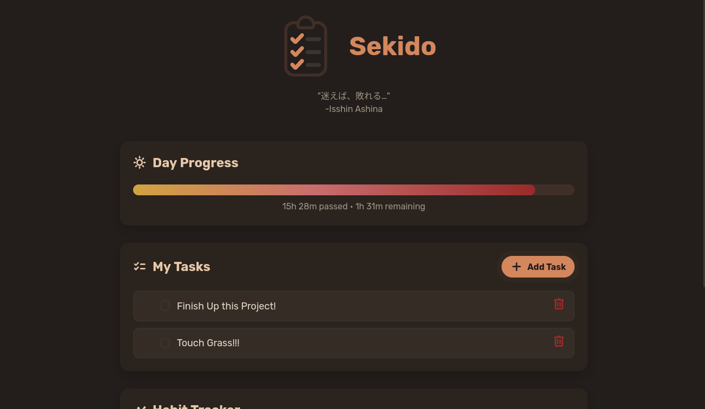
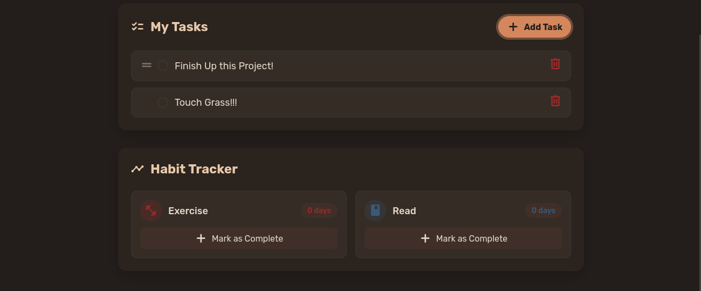

<h1 align="center">
	</br>
	Sekido
</h1>

A beautiful, customizable Progressive Web App for managing todos and tracking daily habits. Built with Cloudflare Workers and D1 database for lightning-fast performance and easy self-hosting.

## 📋 Table of Contents

- [✨ Features](#-features)
- [🖼️ Screenshots](#️-screenshots)
- [🚀 Quick Start](#-quick-start)
- [🔄 Updating Sekido](#-updating-sekido)
- [🌐 Custom Domain Setup](#-custom-domain-setup)
- [⚙️ Configuration](#️-configuration)
- [📱 PWA Configuration](#-pwa-configuration)
- [🤖 Automation & Cron Jobs](#-automation--cron-jobs)
- [🔧 Development](#-development)
- [📋 API Reference](#-api-reference)
- [🎯 Use Cases](#-use-cases)
- [🛠️ Tech Stack](#️-tech-stack)
- [🤝 Contributing](#-contributing)
- [📄 License](#-license)
- [📜 Acknowledgments](#-acknowledgments)
- [💬 Support](#-support)

## ✨ Features

- 📝 **Smart Todo Management** - Create, reorder, and manage tasks with drag-and-drop
- 🎯 **Habit Tracking** - Track daily habits with streak counters and automatic resets
- 📊 **Day Progress Visualization** - Visual progress bar showing your day/night cycle
- 🎨 **Various Stock Themes** - From Catppuccin to Gruvbox, Tokyo Night to Cyberpunk
- 🎛️ **Fully Customizable** - Configure everything from colors to layout modules
- 📱 **PWA Ready** - Install on mobile and desktop with offline support
- 🔒 **Password Protected** - Simple authentication to keep your data private
- ⚡ **Lightning Fast** - Built on Cloudflare's global edge network
- 🌐 **Self-Hostable** - Own your data, deploy anywhere

## 🖼️ Screenshots



## 🚀 Quick Start

### Prerequisites

- **Node.js** 18+ 
- **Cloudflare Account** (free tier works)
- **Wrangler CLI**: `# npm install -g wrangler`

### Installation

1. **Clone the repository**
   
   ```bash
   $ git clone https://github.com/sekiryl/sekido.git
   $ cd sekido
   $ npm install
   ```

2. **Configure your app**
   
   Edit `config.ts` to customize your productivity app:
   
   ```typescript
   export const DEFAULT_CONFIG = {
     title: "My Productivity Hub",
     theme: "tokyo_night",
     accent: "blue",
     logo: "default",
     quote: "Stay focused, stay productive",
     // ... more options
   };
   ```

3. **Set up the database**
   
   ```bash
   # Login to Cloudflare
   $ wrangler login
   
   # Create Cloudflare D1 database
   $ wrangler d1 create sekido-db
   > press 'n' if you are prompted with "Would you like wrangler to add it on your behalf"
   # Update wrangler.jsonc with your database ID
   # Replace "YOUR_DATABASE_ID_HERE" with the ID from the create command
   
   # Apply database migrations
   $ wrangler d1 migrations apply sekido-db --remote
   ```

4. **Configure authentication**
   
   ```bash
   # Set your app password
   $ wrangler secret put PASS
   > press 'y' if you are prompted to create a new worker

   # Optional: Set cron secret for automated tasks
   $ wrangler secret put CRON_SECRET
   ```

5. **Deploy**
   
   ```bash
   $ wrangler deploy
   ```

Your Sekido app is now live! 🎉

## 🔄 Updating Sekido

To get the latest features and deploy config changes:

```bash
# Run the update script
./update.sh
```

This will:
- Pull latest features from upstream
- Preserve your local config.ts changes  
- Deploy the updated app to Cloudflare

**Manual Update (Alternative):**
```bash
git stash
git pull origin main
git stash pop
wrangler deploy
```

## 🌐 Custom Domain Setup

### Using Cloudflare Dashboard

1. **Add your domain to Cloudflare**
   
   - Go to [Cloudflare Dashboard](https://dash.cloudflare.com)
   - Click "Add a Site" and enter your domain
   - Follow the nameserver setup instructions

2. **Configure Worker Route**
   
   - Navigate to **Workers & Pages**
   - Find your deployed Sekido worker
   - Click **Settings**
   - Click **Add Custom Domain** in **Domains & Routes** section
   - Enter your domain (e.g., `todo.yourdomain.com`)
   - Click **Add Custom Domain**

> [!NOTE]
> Custom domains require a Cloudflare account with the domain added to it. Free tier supports custom domains!

## ⚙️ Configuration

### 🎨 Themes

List of Available Themes:

- `sekiratte`

- `catppuccin_mocha`

- `catppuccin_macchiato`

- `catppuccin_frappe`

- `catppuccin_latte`

- `nord`

- `gruvbox_dark`

- `gruvbox_light`

- `tokyo_night`

- `dracula`

- `one_dark`

- `solarized_dark`

- `solarized_light`

- `vaporwave`

- `cyberpunk`

- `hacker`

### 🎛️ Customization Options

```typescript
// App title (appears in header, browser tab, and PWA name)
title: "Sekido",

// Theme name - Available themes in ./src/themes.ts:
// sekiratte, catppuccin_mocha, nord, gruvbox_dark, gruvbox_light, tokyo_night,
// dracula, one_dark, solarized_dark, solarized_light, catppuccin_latte,
// catppuccin_frappe, catppuccin_macchiato, vaporwave, cyberpunk, hacker
theme: "sekiratte",

// Accent color from your theme's color palette
// Available colors: red, green, blue, yellow, purple, pink, teal, orange, 
// peach, mauve, lavender, sky, flamingo, rosewater, maroon
accent: "peach",

// Logo configuration:
// "default" = use built-in logo, "" = no logo, "custom" = use /icon.png
// Place your custom icon at public/icon.png when using "custom"
// Used for header logo, favicon, and PWA icon
logo: "default",

// Quote under the title:
// "default" = built-in quote, "" = no quote, "Your custom quote" = custom text
quote: "default",

// Font family from Google Fonts:
// "default" = use Rubik, "Font Name" = Google Font (e.g., "Inter", "Poppins")
// Browse fonts at https://fonts.google.com
font: "default",

// Hour when daily habits reset (0-23, 24-hour format)
// Example: 3 = habits reset at 3:00 AM
resetHour: 3,

// Define your active day schedule (affects day progress bar)
daySchedule: {
  dayStart: 7,  // Day starts at 7:00 AM
  dayEnd: 23,   // Day ends at 11:00 PM (night period: 11 PM - 7 AM)
},

// App modules - reorder or remove items to customize layout:
// Available: "dayProgress", "todos", "habits"
modules: ["dayProgress", "todos", "habits"],

// Your daily habits to track
// Icons: Browse https://fonts.google.com/icons (use the icon name)
// Colors: Use any color from your theme's palette (see accent colors above)
habits: [
  { id: 1, name: "Exercise", icon: "fitness_center", color: "red" },
  { id: 2, name: "Read", icon: "book", color: "blue" },
  { id: 3, name: "Meditate", icon: "self_improvement", color: "green" },
]
```

### 📱 PWA Configuration

Sekido automatically generates:

- **Dynamic manifest** with your app name and theme colors
- **Custom favicons** using your logo configuration
- **Theme-aware** browser UI colors

## 🤖 Automation & Cron Jobs

Sekido supports automated task management through HTTP endpoints. Perfect for scheduling recurring todos or cleanup tasks.

### Setting Up Cron Secret

First, set your cron secret for security:

```bash
wrangler secret put CRON_SECRET
# Enter a secure random string when prompted and save it somewhere safe
```

### Available Endpoints

#### Auto-Add Recurring Tasks

```bash
POST /api/cron/autoadd?secret=YOUR_SECRET&task=TASK_NAME
```

**Examples:**

```bash
# Add daily workout reminder
curl -X POST "https://your-app.workers.dev/api/cron/autoadd?secret=your_secret&task=Morning Workout"

# Add weekly grocery shopping
curl -X POST "https://your-app.workers.dev/api/cron/autoadd?secret=your_secret&task=Buy Groceries"
```

#### Clean Completed Tasks

```bash
POST /api/cron/cleanup?secret=YOUR_SECRET
```

**Example:**

```bash
# Remove all completed todos
curl -X POST "https://your-app.workers.dev/api/cron/cleanup?secret=your_secret"
```

### Scheduling with External Services

#### GitHub Actions (Weekly Cleanup)

```yaml
name: Weekly Todo Cleanup
on:
  schedule:
    - cron: '0 0 * * 0'  # Every Sunday at midnight
jobs:
  cleanup:
    runs-on: ubuntu-latest
    steps:
      - name: Clean completed todos
        run: |
          curl -X POST "${{ secrets.SEKIDO_URL }}/api/cron/cleanup?secret=${{ secrets.CRON_SECRET }}"
```

#### Cron Job (Daily Task Addition)

```bash
# Add to your server's crontab
# Daily at 6 AM: Add morning routine task
0 6 * * * curl -X POST "https://your-app.workers.dev/api/cron/autoadd?secret=your_secret&task=Morning Routine"

# Weekly on Monday at 9 AM: Add weekly planning
0 9 * * 1 curl -X POST "https://your-app.workers.dev/api/cron/autoadd?secret=your_secret&task=Weekly Planning"
```

- You can also use any web based cron service like EasyCron, cron-job.org, etc.

### Use Cases

- **Daily Routines**: Auto-add morning/evening checklists
- **Weekly Tasks**: Recurring work or personal tasks
- **Maintenance**: Regular cleanup of completed items
- **Reminders**: Important deadlines or appointments
- **Habit Reinforcement**: Daily habit reminders alongside habit tracker

## 🔧 Development

```bash
# Start local development server
wrangler dev

# Deploy to production
wrangler deploy

# Apply database migrations
wrangler d1 migrations apply sekido-db

# View database content
wrangler d1 execute sekido-db --command "SELECT * FROM todos"
```

## 📋 API Reference

### Authentication

- `POST /api/login` - Authenticate user
- `GET /api/check-auth` - Check authentication status

### Todos

- `GET /api/todos` - Get all todos
- `POST /api/todos` - Create new todo
- `PUT /api/todos/:id/toggle` - Toggle todo completion
- `DELETE /api/todos/:id` - Delete todo
- `POST /api/todos/reorder` - Reorder todos

### Habits

- `GET /api/habits` - Get habits with streaks
- `PUT /api/habits/:id/toggle` - Toggle habit completion

### Automation

- `POST /api/cron/autoadd?secret=SECRET&task=TASK` - Auto-add recurring todos
- `POST /api/cron/cleanup?secret=SECRET` - Clean completed todos

## 🎯 Use Cases

- **Personal Productivity** - Track daily tasks and build habits
- **Student Planning** - Manage assignments and study habits
- **Fitness Tracking** - Monitor workout and health habits
- **Creative Projects** - Track artistic and writing goals

## 🛠️ Tech Stack

- **Frontend**: Vanilla JavaScript, Tailwind CSS
- **Backend**: Cloudflare Workers
- **Database**: Cloudflare D1 (SQLite)
- **Icons**: Material Symbols
- **Fonts**: Rubik

## 🤝 Contributing

1. Fork the repository
2. Create a feature branch: `git checkout -b feature-name`
3. Make your changes and test thoroughly
4. Commit with clear messages: `git commit -am 'Add feature'`
5. Push to your branch: `git push origin feature-name`
6. Submit a Pull Request

### Development Guidelines

- Keep the codebase simple and maintainable
- Test all theme combinations
- Ensure mobile responsiveness
- Follow existing code style
- Update documentation for new features

## 📄 License

GNU GPLv3 License - see [LICENSE](LICENSE) for details.

## 📜 Acknowledgments

- **Catppuccin** - Beautiful color schemes
- **Material Design** - Icons
- **Cloudflare** - Excellent edge platform
- **Tailwind CSS** - Utility-first styling

## 💬 Support

- 🐛 [Report Issues](https://github.com/sekiryl/sekido/issues)
- 💬 [Discussions](https://github.com/sekiryl/sekido/discussions)

---

**Made with ❤️ for productivity enthusiasts**

*Self-host your productivity, own your data* 🚀
